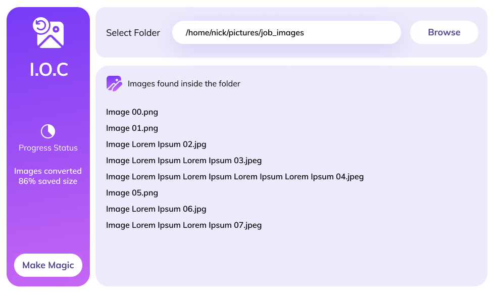

<h1 align="center">Nick - Image Optimization and Conversion 🏞</h1>

Optimize and convert common bitmap images to WebP format.

  <a href="./LICENSE">License</a>

<h3>What is this tool capable of?</h3>

With this awesome and simple tools you can:

<ol>
<li>Pick all images from a specific folder in a mass method (PNG, Gif, JPG and JPEG)</li>
<li>Then remove unnecessary Metadata</li>
<li>Optimize RGB color channels</li>
<li>Compress all images in lossless algorithm</li>
<li>Reduce the image size by 50%</li>
<li>Convert all images to WebP format</li>
</ol>